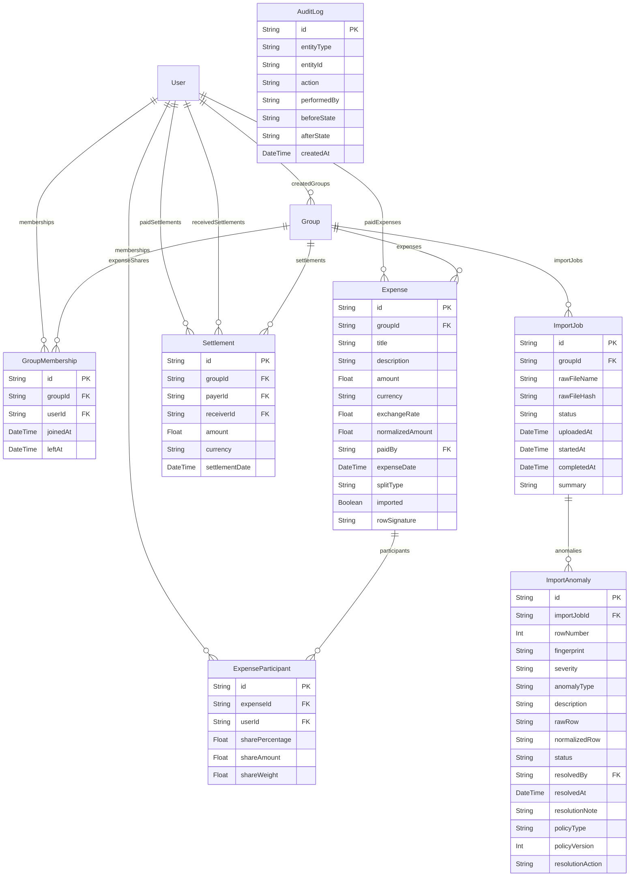

# Ledgerly

## Project Overview
Ledgerly is a self-hosted, multi-user expense reconciliation platform. It allows users to register, log in, create group accounts, record shared transactions, and upload bulk statements in CSV format. The core strength of the system lies in its robust data data import pipeline, which automatically parses transactions, detects logical and financial anomalies (such as fuzzy duplicates, ambiguous dates, and split math errors), and presents them in an interactive dashboard. Through a human-in-the-loop review interface, users can resolve these anomalies before the data is committed.

## Problem Statement
When groups track expenses over long periods, maintaining data integrity becomes difficult. Manual ledger entries are prone to typos, trailing whitespace errors, and split calculation mistakes. Bulk CSV exports from banking applications or other tracking apps often introduce problems, including:
1. **Fuzzy duplicates**: Duplicate uploads or conflicting entries (same date/amount but slightly different names or descriptions).
2. **Date ambiguity**: Formats like `04-05-2026` can be interpreted as April 5th or May 4th.
3. **Membership violations**: Expenses split with individuals who had not yet joined or had already left the group at the transaction date.
4. **Disguised repayments**: Settlements (e.g., "Rohan repaid Aisha") recorded as regular expenses, distorting total spend metrics.
5. **Rounding errors**: Splitting odd amounts (e.g., ₹100 split equally among 3 people) causing floating-point drift.

This project implements a structured normalization, validation, and review framework to clean up and ingest such data while preserving a complete audit trail.

## Features Implemented
- **Group & Membership Life cycles**: Supports adding active members and tracking their active periods (`joinedAt` and `leftAt`). Users can leave groups, excluding them from future splits while preserving historical balance contributions.
- **Dynamic Expense Splitting**: Supports multiple split models:
  - **Equal**: Divides the total amount equally among participants.
  - **Percentage**: Splitting based on custom proportions (must sum to exactly 100%).
  - **Exact / Unequal**: Specifying custom currency amounts for each user (must sum to the total expense).
  - **Share / Weight**: Allocating splits relative to custom user weights (e.g., 2 shares vs. 1 share).
- **Financial Balance Engine**: Computes the net position of each member within a group based on expenses paid, split shares owed, and settlements completed.
- **Cash Flow Minimization**: Minimizes the number of peer-to-peer transactions required to settle up using a greedy match algorithm.
- **Detailed Anomaly Engine**: Detects 10 categories of errors, including duplicate entries (via Levenshtein distance), ambiguous dates, missing payers, missing currencies, negative amounts (refunds), settlement keywords, and split sum mismatches.
- **Human-in-the-Loop Review Queue**: A frontend dashboard where users can map unknown names to registered accounts, correct split details, select ambiguous date options, adjust exchange rates, and approve/reject duplicate rows.
- **Persistent Audit Logs**: Records all database entity state modifications and anomaly resolution decisions.
- **DB Switcher Engine**: Provides a script to seamlessly swap the ORM schema between PostgreSQL (production-grade) and SQLite (zero-dependency development environment).

## Architecture
The application is structured into a client-server architecture:

```text
               +───────────────────────────+
               │   Frontend (React + TS)   │
               +─────────────┬─────────────+
                             │
                             │ (Axios HTTPS Requests)
                             ▼
               +───────────────────────────+
               │   Backend (Express + TS)  │
               +─────────────┬─────────────+
                             │
                             │ (Prisma Client)
        ┌─────────────────────┼─────────────────────┐
        ▼                     ▼                     ▼
 +──────────────+      +──────────────+      +──────────────+
 │Anomalies     │      │Decision      │      │Balance & Debt│
 │Engine        │      │Engine        │      │Engine        │
 +──────────────+      +──────────────+      +──────────────+
        │                     │                     │
        └─────────────────────┼─────────────────────┘
                             │
                             ▼
               +───────────────────────────+
               │  PostgreSQL / SQLite DB   │
               +───────────────────────────+
```

### Tradeoffs & Architecture Decisions
1. **Monolithic UI Component**: The frontend interface is concentrated primarily in a single, robust React application state ([App.tsx](file:///c:/Users/retik/VSCODE/WEBDEV/Projects/Ledgerly/frontend/src/App.tsx)). This simplifies state-sharing between the spreadsheet upload view, the active group panel, and the anomaly resolution drawer, but increases component size.
2. **Text-Payload CSV Ingestion**: CSV files are read on the client side using the browser's FileReader and transmitted as plain text payloads (`POST /imports/analyze`). This eliminates server-side disk access dependencies (making deployment on serverless platforms easier) but limits maximum import sizes (handled by setting JSON limits to `10mb` in Express).
3. **Float Database Typing**: To maintain compatibility between SQLite (which lacks a native decimal type) and PostgreSQL (which supports precise Decimals), fields utilize standard `Float` double-precision numbers. To prevent floating-point accumulation drift, values are rounded to 2 decimal places client-side and server-side.

## Technology Stack
- **Frontend Core**: Vite + React 18 + TypeScript
- **Styling**: TailwindCSS + Lucide Icons
- **Backend Core**: Node.js + Express + TypeScript + Zod (Validation)
- **Database Layer**: Prisma ORM + SQLite (Development) / PostgreSQL (Production)
- **Authentication**: JWT (JSON Web Tokens) + Bcryptjs

## Database Design
The schema is defined in [schema.prisma](file:///c:/Users/retik/VSCODE/WEBDEV/Projects/Ledgerly/backend/prisma/schema.prisma):



## Import Processing Pipeline
The CSV import flow processes statements through distinct stages:

```text
Raw CSV File Uploaded
      │
      ▼
Parsed into Raw Objects (preserves row numbers)
      │
      ▼
Normalized (trim names, check currencies, format unambiguous dates)
      │
      ▼
Anomaly Check (runs duplicate, date, user, currency, and membership checks)
      │
      ▼
Review Queue (human-in-the-loop maps users, overrides exchange rates, resolves conflicts)
      │
      ▼
Finalized & Committed (within atomic database transaction, rounding penny adjusted)
      │
      ▼
Net Balances Recalculation & Cash Flow Minimization Debt Plan
```

## Anomaly Detection Engine
Implemented in [rules.ts](file:///c:/Users/retik/VSCODE/WEBDEV/Projects/Ledgerly/backend/src/anomalies/rules.ts), the engine evaluates rows against ten analytical rules:

| Rule | Severity | Trigger Condition | Detection Mechanism |
| :--- | :--- | :--- | :--- |
| **Missing Payer** | `ERROR` | `paid_by` column is empty | Evaluates if the trimmed raw string has a length of zero. |
| **Ambiguous Date** | `WARNING` | Date format is unclear (e.g. `04-05-2026`) | Checks if the parsed day and month are both $\le 12$ and cannot be auto-inferred chronologically. |
| **Invalid Date** | `BLOCKING` | Date field cannot be parsed | Triggers if standard regex-based date matches fail. |
| **Missing Currency**| `INFO` | Currency column is empty | Evaluates if the trimmed string is blank; automatically defaults to `INR`. |
| **Negative Amount** | `INFO` | Value is less than 0 | Identifies negative floats, classifying them as refund transactions. |
| **Disguised Settlement**| `WARNING` | Description mentions repayment | Scans description against keywords like `repaid`, `settled`, `settlement`, and `returned`. |
| **Zero Amount** | `WARNING` | Cost is exactly `0` | Triggers when the normalized transaction value equals zero. |
| **Split Total Mismatch** | `BLOCKING` | Custom shares do not add up | Sums individual custom splits (percentages must equal 100%, exact figures must sum to total amount). |
| **Unknown User** | `ERROR` | Payer or participant name is not in DB | Queries database to verify if names match active accounts. |
| **Membership Violation**| `ERROR` | Date lies outside active membership | Compares transaction date with the user's group entry/exit log. |

### Fuzzy Duplicate Detection (Levenshtein Distance)
Fuzzy duplicate detection compares incoming entries with pre-existing database records and other items in the same upload. It cleans descriptions and checks matches:
- **High Confidence duplicate** (`WARNING`): Identical date, amount, payer, and description similarity $\ge 80\%$ (Levenshtein calculation).
- **Medium Confidence duplicate** (`INFO`): Identical date, amount, payer, with description similarity between $40\%$ and $80\%$.
- **Low Confidence conflict** (`INFO`): Identical date, amount, similarity $\ge 80\%$, but different payers (indicating conflicting entries).

## Human Review Workflow
When an upload contains anomalies, its status is set to `REVIEW_REQUIRED`. The UI loads these rows into the interactive review panel:
1. **User Mapping**: If an unknown user (e.g., `"Priya S"`) is detected, the interface allows mapping the user to an existing registered user (e.g., `"Priya"`).
2. **Date Selection**: The user explicitly chooses between `DD/MM/YYYY` and `MM/DD/YYYY` for ambiguous dates.
3. **Repayment Conversion**: If a disguised settlement is flagged, the user can approve its conversion, transforming the expense record into a direct `Settlement` entity.
4. **Exchange Rate Overriding**: For non-INR currencies, the user can override the default rate ($83.0$) with the actual rate from their statement.
5. **Percentage Corrections**: Mismatched split percentages can be auto-normalized back to 100% or corrected manually.

Upon submission, the frontend posts these resolutions. The backend executes `DecisionEngine.processRow` to apply the overrides, recalculates the participant shares, and writes the finalized entries.

## Security Considerations
- **Session Authentication**: JWT tokens are securely stored in the client's `localStorage` and sent via `Authorization: Bearer <token>` request headers. The backend also supports fallback reading from `httpOnly` cookies.
- **Cascade Deletes**: Foreign key constraints in the database are configured with `onDelete: Cascade`. Removing a group automatically and cleanly purges all its memberships, expenses, participants, settlements, and import history.
- **Input Sanitization**: Database operations route exclusively through Prisma ORM, which parameterized SQL queries natively, preventing SQL injection vulnerabilities. Route validation schemas (Zod) enforce strict typing.

## Challenges Faced
- **Precise Float Splits (Penny Adjustment)**: Equal division of numbers not divisible by the number of participants can lead to fractional values. To prevent overall transaction total mismatch, the calculations compute the difference between the sum of individual rounded shares and the total cost, applying the remainder (usually $\pm$ 1-2 paise) to the last participant.
- **SQLite Date Representation**: SQLite stores date-time instances as ISO strings. The code normalizes JS date objects to ISO strings (`new Date().toISOString()`) before passing them to queries, ensuring string-to-date comparisons operate correctly.

## Design Decisions
1. **Transactional Commits**: To protect data integrity, the entire csv finalizing operation runs inside a single database transaction (`prisma.$transaction`). If a single row fails user resolution or validation, the database rolls back, preventing partial imports.
2. **Audit Logs for State Changes**: Every creation/deletion of an expense, settlement, or CSV resolution creates an audit entry detailing the modified payload. This is displayed on the diagnostic mode screen (`GET /admin/demo`).
3. **Soft Deletions**: Transactions deleted by users are not physically deleted. Instead, a `deletedAt` timestamp is set, ensuring they are excluded from current balance calculations while preserving imports history and logs.

## Future Improvements
- **Automated CSV Schema Detection**: Add support for dynamic column mapping to import CSV layouts that do not match the default columns.
- **OCR Receipt Parsing**: Integrate receipt OCR scanning to pre-fill manual expense entries.
- **Caching Layer**: Cache group balance computations to optimize page loads for large groups.

## Running Locally

### Backend Setup
1. Navigate to the backend directory:
   ```bash
   cd backend
   ```
2. Install dependencies:
   ```bash
   npm install
   ```
3. Initialize the dev database (SQLite fallback), run migrations, and seed:
   ```bash
   npx prisma generate
   npx prisma migrate dev --name init
   ```
4. Start the backend development server:
   ```bash
   npm run dev
   ```
   *(Running at `http://localhost:4000`)*

### Frontend Setup
1. Navigate to the frontend directory:
   ```bash
   cd ../frontend
   ```
2. Install dependencies:
   ```bash
   npm install --legacy-peer-deps
   ```
3. Start the frontend development server:
   ```bash
   npm run dev
   ```
   *(Running at `http://localhost:5173`)*

---

### Database Schema Switcher
If you want to run the project using **PostgreSQL** instead of SQLite:
1. Navigate to the `backend` directory.
2. Run the database switcher script:
   ```bash
   node prisma/switch-db.js postgres
   ```
3. Open `backend/.env` and update the `DATABASE_URL` with your PostgreSQL connection string.
4. Run the migrations:
   ```bash
   npx prisma generate
   npx prisma migrate dev --name init
   ```
To switch back to **SQLite**:
```bash
node prisma/switch-db.js sqlite
```

## Environment Variables
Create a `.env` file in the `backend` directory:
```env
PORT=4000
DATABASE_URL="file:./dev.db"
JWT_SECRET="super-secret-shared-expense-manager-key-2026"
```

## API Overview

### Authentication
- `POST /auth/register`: Register a new user account.
- `POST /auth/login`: Authenticate a user and receive a JWT token.
- `GET /auth/me`: Get current logged-in user profile details.

### Groups & Memberships
- `POST /groups`: Create a new group.
- `GET /groups`: Fetch all groups the active user belongs to.
- `GET /groups/:id`: Retrieve detailed group metadata and active membership list.
- `PATCH /groups/:id`: Update group name (only allowed for group creator).
- `POST /groups/:id/members`: Add a user to a group.
- `PATCH /membership/:id`: Update membership joined/left timestamps.
- `DELETE /membership/:id`: Soft-leave a group (sets `leftAt` date).

### Expenses & Settlements
- `POST /expenses`: Create a new manual expense entry.
- `GET /expenses/group/:groupId`: Get active expenses for a group.
- `DELETE /expenses/:id`: Soft-delete an expense.
- `POST /settlements`: Log a new settlement payment.
- `GET /settlements/group/:groupId`: Get active settlements for a group.
- `DELETE /settlements/:id`: Soft-delete a settlement.

### Financial Calculations
- `GET /balances/global`: Fetch the global receivables and payables summary across all groups.
- `GET /balances/group/:groupId`: Compute group net balances and the simplified payment plan.

### Statements Imports
- `GET /imports/jobs`: Retrieve all uploaded CSV statement import jobs.
- `POST /imports/analyze`: Upload and dry-run analyze a CSV statement file for anomalies.
- `POST /imports/:id/finalize`: Submit resolutions and finalize the CSV import.

### Administration
- `GET /admin/demo`: Expose diagnosis records, import logs, and audit logs.

## Screenshots Placeholders
*Dashboard View*


*Review Queue Panel*


## License
Distributed under the MIT License.
